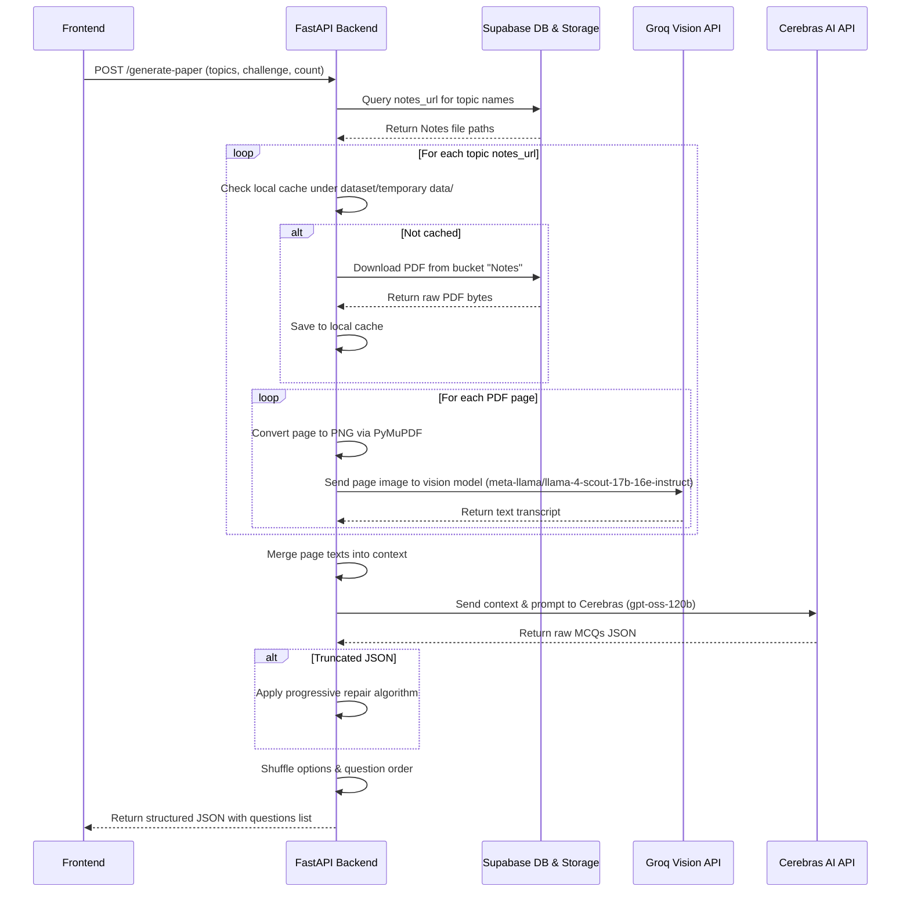

# VidyaX Project Brain (Knowledge Base & Code Map)

This document maps all files, core flows, database structures, and system configurations for the VidyaX project. Refer to this document to understand the codebase structure and key modules without having to read files repeatedly.

---

## 🏗️ System Architecture

VidyaX is an AI-first learning platform tailored for GATE Computer Science aspirants. It uses a **Python (FastAPI)** backend and a **Next.js (React 19 + Tailwind 4)** frontend.

### Tech Stack Summary
- **Backend**: Python 3, FastAPI, Supabase (PostgreSQL client & Storage), PyMuPDF (PDF processing), Groq Cloud API (Vision/OCR), Cerebras API (high-speed MCQ generation & text analysis), Slowapi (rate limiting).
- **Frontend**: Next.js 16 (App Router), React 19, Framer Motion (premium micro-animations), Tailwind CSS 4, Lucide React (icons), KaTeX (LaTeX math rendering).

---

## 📁 Project Directory Map

### Backend Codebase
- [main.py](file:///d:/prograamming/VidyaX/backend/main.py): FastAPI application root with middleware, exception handlers, and API routers.
- **Routers** (`backend/routers/`):
  - [subjects.py](file:///d:/prograamming/VidyaX/backend/routers/subjects.py): Fetches subject lists.
  - [topics.py](file:///d:/prograamming/VidyaX/backend/routers/topics.py): Fetches topics and subject metadata.
  - [generate.py](file:///d:/prograamming/VidyaX/backend/routers/generate.py): Orchestrates PDF download, OCR translation, and Cerebras MCQ paper generation.
  - [chat.py](file:///d:/prograamming/VidyaX/backend/routers/chat.py): Handles chatbot guidance for incorrect answers (TopperBhai AI Tutor).
  - [grammar.py](file:///d:/prograamming/VidyaX/backend/routers/grammar.py): Evaluates written drafts and offers follow-up grammatical coaching (TopperBhai Grammar Coach).
  - [video.py](file:///d:/prograamming/VidyaX/backend/routers/video.py): Handles academic query filtering, scraping YouTube videos, and scoring them for recommendation.
- **Models** (`backend/models/`):
  - [chat_request.py](file:///d:/prograamming/VidyaX/backend/models/chat_request.py): Pydantic validation for student-tutor chat.
  - [grammar_request.py](file:///d:/prograamming/VidyaX/backend/models/grammar_request.py): Validation for writing checks and follow-ups.
  - [paper_request.py](file:///d:/prograamming/VidyaX/backend/models/paper_request.py): Validation for creating question papers.
  - [video_request.py](file:///d:/prograamming/VidyaX/backend/models/video_request.py): Validation for video search.
- **Database Interface** (`backend/db/`):
  - [supabase_client.py](file:///d:/prograamming/VidyaX/backend/db/supabase_client.py): Initializes connection to Supabase via Service Role key.
  - [limiter.py](file:///d:/prograamming/VidyaX/backend/db/limiter.py): In-memory rate limiting configuration.
- **Scripts & Tools**:
  - [sync_dataset.py](file:///d:/prograamming/VidyaX/backend/scripts/sync_dataset.py): Scans local PDFs, updates subjects/topics tables in DB, uploads PDFs to storage bucket, and pre-extracts text directly into `topic_content`.
  - [load_pdf.py](file:///d:/prograamming/VidyaX/backend/scripts/load_pdf.py): Extracts text from local PDFs (with Tesseract OCR fallback).
  - [upload_to_supabase.py](file:///d:/prograamming/VidyaX/backend/scripts/upload_to_supabase.py): Uploads text files to database `topic_content` table.
  - [inspect_extraction.py](file:///d:/prograamming/VidyaX/backend/inspect_extraction.py): Command line test for Groq Vision transcription on individual PDF pages.
  - [fix_notes_url.py](file:///d:/prograamming/VidyaX/backend/fix_notes_url.py): Aligns file casing between DB rows and Supabase Storage.

### Frontend App Structure
- **Global Context & Navigation**:
  - [layout.tsx](file:///d:/prograamming/VidyaX/FrontEnd/app/layout.tsx): App container and entry point.
  - [globals.css](file:///d:/prograamming/VidyaX/FrontEnd/app/globals.css): Premium design system variables, global CSS, glassmorphism, animations, and Tailwind rules.
  - [navigation.tsx](file:///d:/prograamming/VidyaX/FrontEnd/components/navigation.tsx): Responsive top navigation and back navigation headers.
  - [vidyax-ui.tsx](file:///d:/prograamming/VidyaX/FrontEnd/components/vidyax-ui.tsx): UI components (AuroraBackground, GlassCard, GradientButton, AIBadge, VidyaXLogo, skeletons).
- **Core App Views**:
  - [page.tsx](file:///d:/prograamming/VidyaX/FrontEnd/app/page.tsx): Main homepage / marketing dashboard highlighting core features.
  - [pricing/page.tsx](file:///d:/prograamming/VidyaX/FrontEnd/app/pricing/page.tsx): Pricing options. Contains license key activation logic (local storage key starting with `vx_` unlocks Pro capabilities).
  - [subjects/page.tsx](file:///d:/prograamming/VidyaX/FrontEnd/app/subjects/page.tsx): Selection dashboard containing all 13 GATE CS subjects.
  - [topics/[subjectId]/page.tsx](file:///d:/prograamming/VidyaX/FrontEnd/app/topics/[subjectId]/page.tsx): Chapter selection checklist dynamically loaded from DB.
  - [difficulty/[subjectId]/page.tsx](file:///d:/prograamming/VidyaX/FrontEnd/app/difficulty/[subjectId]/page.tsx): Difficulty level selector (Rookie, Practice, Competitive, Topper). Unlocks Pro features if license validation passes.
  - [generating/[subjectId]/page.tsx](file:///d:/prograamming/VidyaX/FrontEnd/app/generating/[subjectId]/page.tsx): Loading sequence with step-by-step progress tracking paper generation.
  - [success/[subjectId]/page.tsx](file:///d:/prograamming/VidyaX/FrontEnd/app/success/[subjectId]/page.tsx): The exam paper interface with stopwatch controls, expandable solutions, and the print layout.
- **Interactive Tools** (`FrontEnd/app/features/`):
  - [concept-dojo/page.tsx](file:///d:/prograamming/VidyaX/FrontEnd/app/features/concept-dojo/page.tsx): AI-curated video recommendations showing inline YouTube players and relevance explanation cards.
  - [focus-dojo/page.tsx](file:///d:/prograamming/VidyaX/FrontEnd/app/features/focus-dojo/page.tsx): Customized Pomodoro focus timer with Web Audio API chime sounds and quote lists.
  - [scribe-dojo/page.tsx](file:///d:/prograamming/VidyaX/FrontEnd/app/features/scribe-dojo/page.tsx): Writing Lab application with custom diff highlighting, grammatical rule breakdowns, and follow-up AI chats.
  - [task-quest/page.tsx](file:///d:/prograamming/VidyaX/FrontEnd/app/features/task-quest/page.tsx): Kanban study board with custom reminders and local storage backup.
- **Shared Components & Utilities**:
  - [QuestionChat.tsx](file:///d:/prograamming/VidyaX/FrontEnd/components/QuestionChat.tsx): Embedded chat console allowing users to query mistake logic with the AI Tutor.
  - [LatexRenderer.tsx](file:///d:/prograamming/VidyaX/FrontEnd/components/LatexRenderer.tsx): Mounts the KaTeX CSS/JS libraries dynamically to format mathematical formulas on the screen.
  - [manga-ui.tsx](file:///d:/prograamming/VidyaX/FrontEnd/components/manga-ui.tsx): UI widgets (OwlSpeech, ComicActionButton, MangaPanel, LoadingPanelSequence).
  - [utils.ts](file:///d:/prograamming/VidyaX/FrontEnd/lib/utils.ts): Helper logic for tailwind merging and endpoint URL formatting (`getApiUrl`).

---

## 🗄️ Database & Storage Design

Supabase PostgreSQL is utilized with three principal tables and one storage bucket:

### 1. `subjects` Table
Stores high-level subjects (e.g. Algorithms, DBMS, Operating Systems).
- `id` (UUID, primary key)
- `name` (text, e.g. "Data Structures")
- `slug` (text, unique url identifier, e.g. "data-structures")
- `code` (text, shorthand code, e.g. "DS")
- `description` (text, short syllabus summary)

### 2. `topics` Table
Stores individual chapters/topics mapped to parents.
- `id` (UUID, primary key)
- `subject_id` (UUID, foreign key referencing `subjects.id`)
- `name` (text, e.g. "Stacks and Queues")
- `notes_url` (text, file path in Storage bucket, e.g. "Programming and DS/Stacks and Queues.pdf")

### 3. `topic_content` Table
Stores extracted plain text for rapid RAG-based examination generation.
- `id` (UUID, primary key)
- `topic_id` (UUID, foreign key referencing `topics.id`)
- `content` (text, raw page text extracted from notes)
- `word_count` (int)
- `source_pdf` (text, filename)

### 4. Storage Bucket `Notes`
Contains raw PDF notes under folder prefixes corresponding to their topic (e.g., `Notes/Computer Network/`, `Notes/Operating System/`).

---

## ⚡ Core Operational Workflows

### 📝 MCQ Practice Paper Generation


### 💬 Mistake Analysis & AI Tutor
- When a user answers a question incorrectly on [success/page.tsx](file:///d:/prograamming/VidyaX/FrontEnd/app/success/[subjectId]/page.tsx), [QuestionChat.tsx](file:///d:/prograamming/VidyaX/FrontEnd/components/QuestionChat.tsx) mounts.
- It triggers a `POST` request to `backend/routers/chat.py` (`/api/v1/chat/analyze-mistake`).
- The backend evaluates the student's incorrect option against the correct option and original explanation.
- Prompt parameters instruct Cerebras `gpt-oss-120b` to provide supportive, step-by-step reasoning in a friendly mentor tone.

### 🎥 AI Video Recommendations
- The user submits an academic query on [concept-dojo/page.tsx](file:///d:/prograamming/VidyaX/FrontEnd/app/features/concept-dojo/page.tsx).
- The query goes to `backend/routers/video.py` (`/api/v1/video/recommend`).
- The backend verifies if the query is academic using Cerebras. If not academic, it returns a sardonically motivational rejection message in Hinglish.
- If academic, it uses Cerebras to generate two optimized YouTube query strings.
- It scrapes search pages using a keyless scraper (fetching title, description, channel, duration, and views).
- If YouTube blocks the scraper, it injects high-quality preset fallback videos.
- It sends the list to Cerebras to score, write recommendations, and return the top 5 videos.

---

## 🛠️ CLI Tools & Operational Scripts

1. **Synchronizing Local Datasets to Supabase**:
   ```powershell
   python backend/scripts/sync_dataset.py
   ```
   - Automatically processes subjects inside `dataset/`.
   - Creates subject rows if missing.
   - Uploads PDFs to storage bucket.
   - Saves direct PyMuPDF text extractions into the database.

2. **Testing OCR & Page Transcriptions**:
   ```powershell
   python backend/inspect_extraction.py
   ```
   - Utility tool to debug Groq Vision OCR on single PDF pages. Saves results to `extracted_output.txt`.

3. **URL Case Alignment**:
   ```powershell
   python backend/fix_notes_url.py
   ```
   - Scans storage files and database urls to correct capitalization differences.
